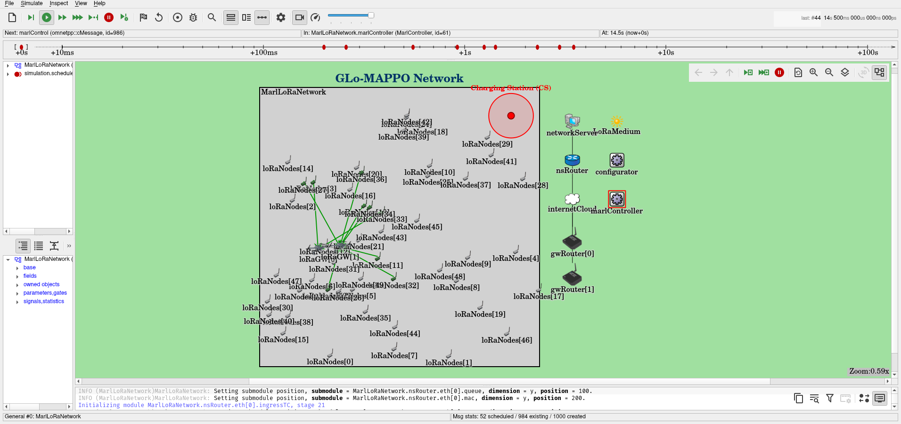

<!-- 
# GLo-MAPPO: Multi-Agent Deep Reinforcement Learning for Energy-Efficient UAV-Assisted LoRa Networks

This repository provides the reference implementation for **GLo-MAPPO**, a framework that utilizes Multi-Agent Proximal Policy Optimization (MAPPO) to optimize network topology and energy efficiency in UAV-assisted LoRa networks. 

The framework combines a trained **GLo-MAPPO policy** with a deterministic execution module to simultaneously manage three critical tasks:

1. **Dynamic Trajectory Control (Policy-Driven):** The learned policy learns to fly energy-efficient paths across the target deployment area.
2. **Resource Allocation (Policy-Driven):** The learned policy dynamically sets the Spreading Factor (SF) and Transmission Power (TP) for every associated node to maximize global energy efficiency.
3. **Device Association:** A channel-aware association scheme maps the link connections between ground LoRa End Devices (EDs) and in-range UAV gateways based on the current channel gains.


The system is trained using a custom OpenAI Gym environment and validated via a live, closed-loop co-simulation connected to a packet-level **OMNeT++ / INET / FLoRa** network simulator. -->

# GLo-MAPPO: Multi-Agent Deep Reinforcement Learning for Energy-Efficient UAV-Assisted LoRa Networks

This repository provides the reference implementation for **GLo-MAPPO**, a framework that utilizes Multi-Agent Proximal Policy Optimization (MAPPO) to optimize network topology and energy efficiency in UAV-assisted LoRa networks. The framework combines a trained **GLo-MAPPO policy** with a deterministic execution module to simultaneously manage three critical tasks:

1. **Dynamic Trajectory Control (Policy-Driven):** The learned policy optimizes energy-efficient paths across the target deployment area.
2. **Resource Allocation (Policy-Driven):** The learned policy dynamically sets the Spreading Factor (SF) and Transmission Power (TP) for every associated node to maximize global energy efficiency.
3. **Device Association (Channel-Aware Heuristic):** A localized association scheme that maps the link connections between ground LoRa End Devices (EDs) and in-range UAV gateways based on the current channel gains.

The system is trained using a custom OpenAI Gym environment and validated via a live, closed-loop co-simulation connected to a packet-level **OMNeT++ / INET / FLoRa** network simulator.

---

## Repository layout

```
GLo_MAPPO/
├── src/                     # MAPPO / EPyMARL training + evaluation
│   ├── main.py              #   training entry point (configured with Sacred)
│   ├── config/              #   algorithm + env YAML configs (mappo.yaml, envs/gymma.yaml, ...)
│   └── envs/MADE/gym_mdde1/ #   the custom LoRa gym environment (MultiFlyingLoRaEnv)
├── models/                  # pretrained GLo-MAPPO policy (agent.th) 
├── flora_run/               # closed-loop co-simulation bridge (policy server + env socket)
│   ├── policy_server.py     #   Terminal A: serves the trained policy on :6000
│   ├── env_socket.py        #   Terminal B: env socket managing observations/actions
│   ├── run_python_eval_logged.py    # standalone eval (no FLoRa)
│   └── report_cosim_comparison.py   # builds the standalone-vs-tier validation
├── flora-stack/             # FLoRa/OMNeT++ simulator engine 
├── assets/                  # figures for this README
├── supplementary/           # extra paper figures such as duty-cycle, trajectories, collisions
├── requirements.txt         # pinned Python dependencies
├── install_flora_stack.sh   # one-shot compilation script for OMNeT++/INET/FLoRa
├── LICENSE  /  NOTICE       # Apache-2.0 open-source infrastructure licenses
├── glo_env_policy.cmd       # closed-loop launcher — Terminal A: policy server on :6000
├── glo_env_socket.cmd       # closed-loop launcher — Terminal B: env<->policy bridge :6000->:5000
├── glo_env_flora.cmd        # launcher — opens FLoRa (Qtenv GUI / Cmdenv) on an .ini
├── glo_env_omnetpp.cmd      # launcher — opens the OMNeT++ IDE (loads GCC/Qt5 + Java)
└── README.md             
```
---

## Setup

Python 3.11 is highly recommended, as it was the version used to develop and test this project.

**Create a virtual environment with `conda` and install all required dependencies:**
```bash
conda create -n glo_mappo python=3.11 -y
conda activate glo_mappo
pip install -r requirements.txt
```


Then install the custom LoRa gym environment:
```bash
pip install -e src/envs/MADE
```

Quick check:
```bash
python -c "import torch, gym, gym_mdde1; print('env OK')"
```

---

## Running Experiments


### 1. GLo-MAPPO Training Script 
To train the default model with seed=41, run the following command from the source directory:

```bash
cd src
python main.py --config=mappo --env-config=gymma with \
    name="glo_ed50" \
    seed=41 \
    runner="parallel" \
    use_rnn=True \
    buffer_cpu_only=False \
    batch_size_run=20 \
    lr=0.003 \
    lr_decay=True \
    lr_decay_min_frac=0.1 \
    gamma=0.99 \
    eps_clip=0.2 \
    epochs=4 \
    entropy_coef=0.001 \
    t_max=2000000 \
    save_model_interval=25000 \
    save_model=True \
    env_args.key="LoRaEnv-v1" \
    env_args.time_limit=500 \
    env_args.max_episode_steps=500 \
    env_args.num_uavs=2 \
    env_args.num_eds=50 \
    env_args.area_size="[1000, 1000]" \
    env_args.uav_altitude=150 \
    env_args.max_speed=30 \
    env_args.comm_range=300 \
    env_args.safe_distance=3
```

Note: `--config=<alg>` picks the specific algorithm setup from ([`src/config/algs/`](src/config/algs)), `--env-config=gymma` configures the environment wrapper, and the parameters following with override the default configuration settings. Trained models are saved to `src/results/models/<name>-...`


### 2. Ablation Studies
These setups retain the same MAPPO hyperparameters as above. Only the environment ID `env_args.key` and specific control parameters change. To change the association mode, set `env_args.assoc_mode` to one of: {gain, distance, random, fixed}.

```bash
python main.py --config=mappo --env-config=gymma with \
    name="aabl_gain" seed=41 \
    env_args.key="LoRaEnvAssociationSchemeAblationStudy-v3" env_args.assoc_mode=gain \
    runner="parallel" use_rnn=True buffer_cpu_only=False batch_size_run=20 \
    lr=0.003 lr_decay=True lr_decay_min_frac=0.1 \
    gamma=0.99 eps_clip=0.2 epochs=4 entropy_coef=0.001 \
    t_max=2000000 save_model_interval=25000 save_model=True \
    env_args.time_limit=500 env_args.max_episode_steps=500 \
    env_args.num_uavs=2 env_args.num_eds=50 "env_args.area_size=[1000,1000]" \
    env_args.uav_altitude=150 env_args.max_speed=30 env_args.comm_range=300 env_args.safe_distance=3
```

To run the optimization parameter ablation study, adjust the target environment key and set `env_args.opt_mode` to one of: `{full, fix_sf, fix_tp, fix_position, fix_all}`.

### 3. Benchmark baselines

To run alternative baselines, replace `--config` with any supported algorithm found in `src/config/algs/` (e.g., `qmix`, `vdn`, `coma`, `maa2c`, `ippo`).

Note: While each framework brings its own independent learner, critic architecture, and learning rate, the shared infrastructure parameters remain identical:

```bash
python main.py --config=qmix --env-config=gymma with \
    name="qmix_ed50" seed=41 \
    env_args.key="LoRaEnv-v1" \
    runner="parallel" use_rnn=True buffer_cpu_only=False batch_size_run=20 \
    gamma=0.99 t_max=2000000 save_model_interval=25000 save_model=True \
    env_args.time_limit=500 env_args.max_episode_steps=500 \
    env_args.num_uavs=2 env_args.num_eds=50 "env_args.area_size=[1000,1000]" \
    env_args.uav_altitude=150 env_args.max_speed=30 env_args.comm_range=300 env_args.safe_distance=3
```

---


## Closed-Loop Co-Simulation (OMNeT++/INET/FLoRa)

The trained GLo-MAPPO policy drives **two UAV gateways** in real time inside a packet-level LoRa network simulator. At every $t$, FLoRa measures the channel states, the Python policy output the next actions (UAV movements and per-node SF/TP configurations), and FLoRa applies them dynamically. This co-simulation is evaluated across three channel tiers:
* **Tier-1:** Analytic air-to-ground (A2G) model.
* **Tier-2:** A2G model with log-normal shadowing.
* **Tier-3:** Native Oulu terrestrial propagation model.



*Two UAV gateways (starting from the bottom-left) serve ground LoRa nodes and dynamically re-associate as they fly toward the charging station. Green links denote end devices actively served during the current control step.*

### ▶ Demo Video

Watch our closed-loop co-simulation demo in action on YouTube: **[https://youtu.be/5H73WmQZgK4](https://youtu.be/5H73WmQZgK4)**

---

### Running the Co-Simulation

#### Step 1: Build the Simulator (Once)
Fetch and build the core simulation suite (OMNeT++ 6.0.3, INET 4.4.1, and FLoRa 1.1.0) and merge our custom simulation overlay. Detailed line-by-line build instructions can be found in **[`flora-stack/README.md`](flora-stack/README.md)**:

```bash
bash install_flora_stack.sh all
```


#### Step 2: Execute the Three-Terminal Closed Loop
Open three separate terminal windows on the same host and start the processes in strict order: Terminal A → Terminal B → Terminal C.

The `--tier` flag specified in Terminal B must match the active `.ini` file chosen in Terminal C (e.g., Tier 1, 2, or 3). The setup uses port `6000` for the policy server and port `5000` for the environment bridge socket.

```bash
# Terminal A: Policy Server (Run within your conda/virtual environment)
# This process handles policy inference and will wait for a connection.
python flora_run/policy_server.py 

# Terminal B: Environment Bridge (Run within your conda/virtual environment)
# Change the --tier flag {1, 2, 3} to match your target scenario.
python flora_run/env_socket.py --tier 1 --logdir flora_run/timing_logs

# Terminal C — FLoRa Framework (DO NOT activate your conda environment here; source the native toolchain instead)
source flora-stack/use_flora.sh
cd flora-stack/flora/simulations

# Run with a Graphical User Interface:
./run -u Qtenv -f examples/glo-2gw-50ed-a2g-tier1.ini 

# Or run in Command-line mode:
# ./run -u Cmdenv -f examples/glo-2gw-50ed-a2g-tier1.ini
```

---

## Citation

If you use this code in your research, kindly cite our work:

```bibtex
Coming soon...!!!
```
---

## Acknowledgements

This project builds directly upon and integrates components from the following open-source frameworks:

* **EPyMARL / PyMARL:** The underlying Python/MARL code implementation. [https://github.com/uoe-agents/epymarl](https://github.com/uoe-agents/epymarl)
* **Gym:** Used for environment wrappers and reinforcement learning tracking. [https://gymnasium.farama.org/index.html](https://gymnasium.farama.org/index.html)
* **OMNeT++:** The core component of the network simulation environment. [https://github.com/omnetpp/omnetpp](https://github.com/omnetpp/omnetpp)
* **INET Framework:** Provides the foundational network models and protocol stacks. [https://github.com/inet-framework/inet](https://github.com/inet-framework/inet)
* **FLoRa:** The LoRa network simulator extended by the `flora-stack/` simulator overlay. [https://github.com/florasim/flora](https://github.com/florasim/flora)


