# Supplementary Material

This folder contains extra figures for our paper: **GLo-MAPPO: A Multi-Agent Proximal Policy Optimization Framework for Energy-Efficient UAV-Assisted LoRa Networks**.

Due to page limit, these figures could not fit in the paper. Therefore, we include them here to give a full picture of how the proposed framework behaves and to support the discussions in the manuscript.

---

## 1. Duty-Cycle Constraint Validation

LoRa devices are only allowed to transmit for a limited fraction of time (the *duty-cycle* limit). The revised manuscript adds this constraints so the learned policy never asks a device to transmit more than the rules permit.

| (a) Airtime used per end device | (b) Airtime vs. number of transmissions |
|:-------------------------------:|:---------------------------------------:|
| 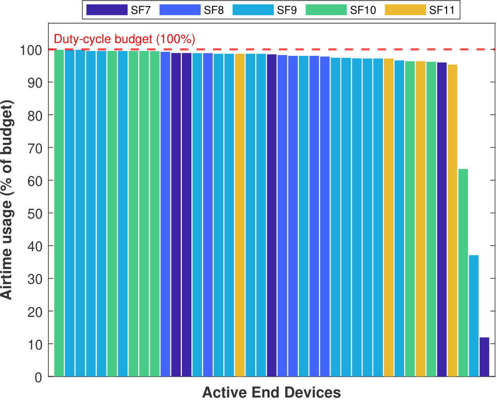 | 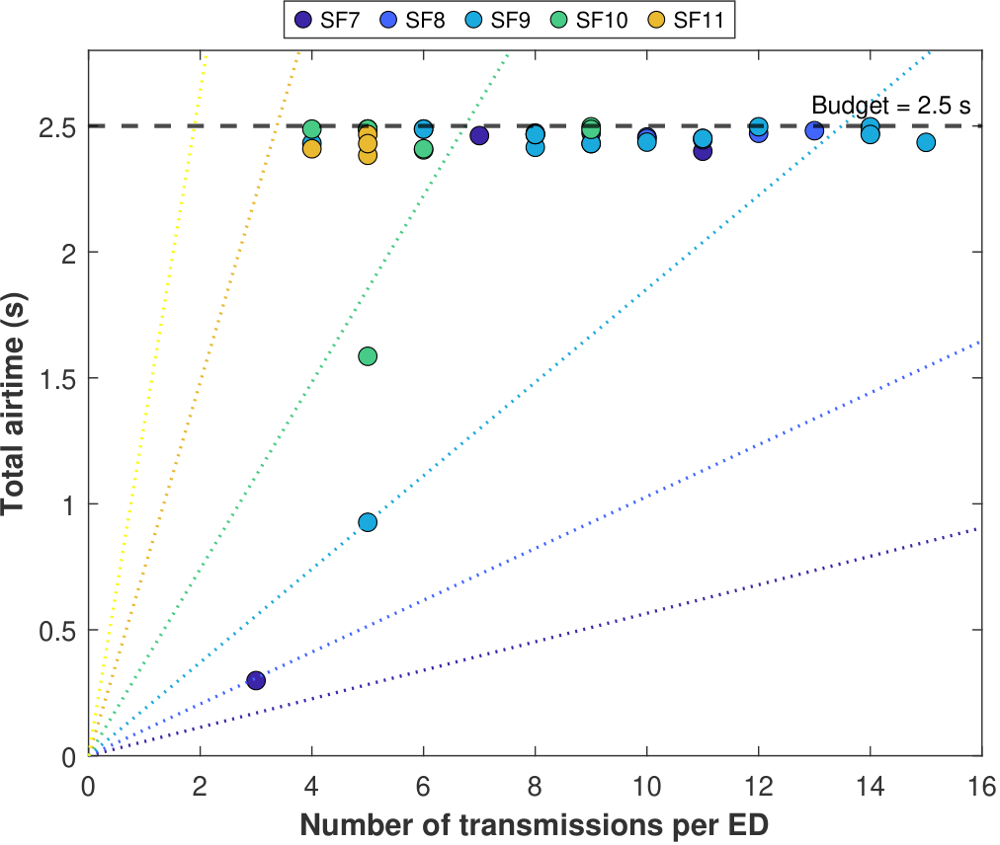 |

**Figure (a)** shows how much of each device's allowed airtime it actually used by the end of an episode, as a percentage of its budget. The policy makes good use of the available airtime. Hence, most devices sit between **95% and 100%** of their budget. Crucially, **no device goes over 100%**, which confirms the duty-cycle limit is respected.

**Figure (b)** shows how the total airtime a device spends grows with the number of packets it sends, grouped by spreading factor (SF). As shown from the figure, a higher SF makes each packet take longer to send, so those devices use up their airtime budget after fewer packets. Devices on a lower SF send each packet faster and can therefore fit many more packets into the same budget.

---

## 2. Learned UAV Trajectories for Different Numbers of UAV Gateways

### Scenario A: 4 UAV Gateways

| (a) 2D flight paths | (b) 3D flight paths and device links |
|:-------------------:|:------------------------------------:|
| 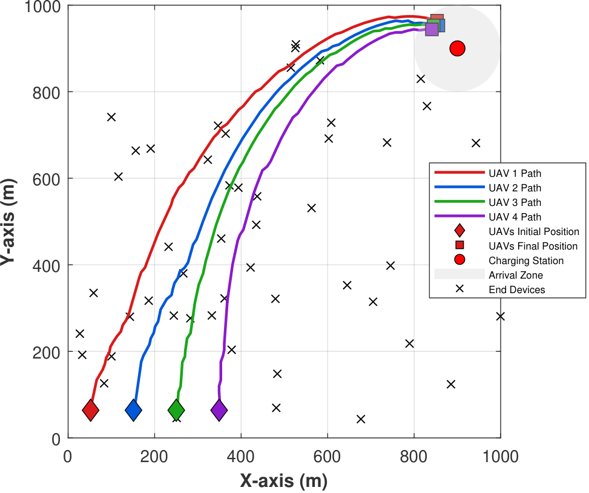 | 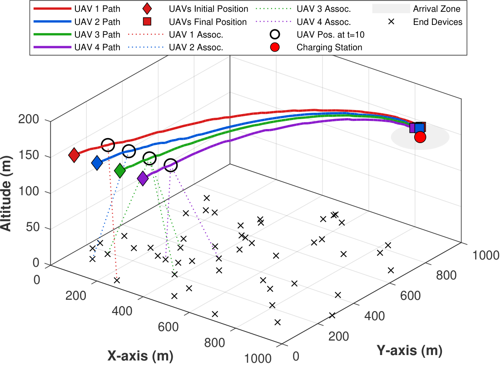 |

The 2D view shows the four UAVs starting from different points, flying toward the areas where active devices are located, and then converging toward the arrival zone. The paths stay well apart the whole time, so the UAVs coordinate their movement while keeping a safe distance from one another.

The 3D view shows which device each UAV is serving at **t = 10 s**, illustrating how the communication links change as the UAVs move.

### Scenario B: 10 UAV Gateways

| (a) 2D flight paths | (b) 3D flight paths and device links |
|:-------------------:|:------------------------------------:|
| 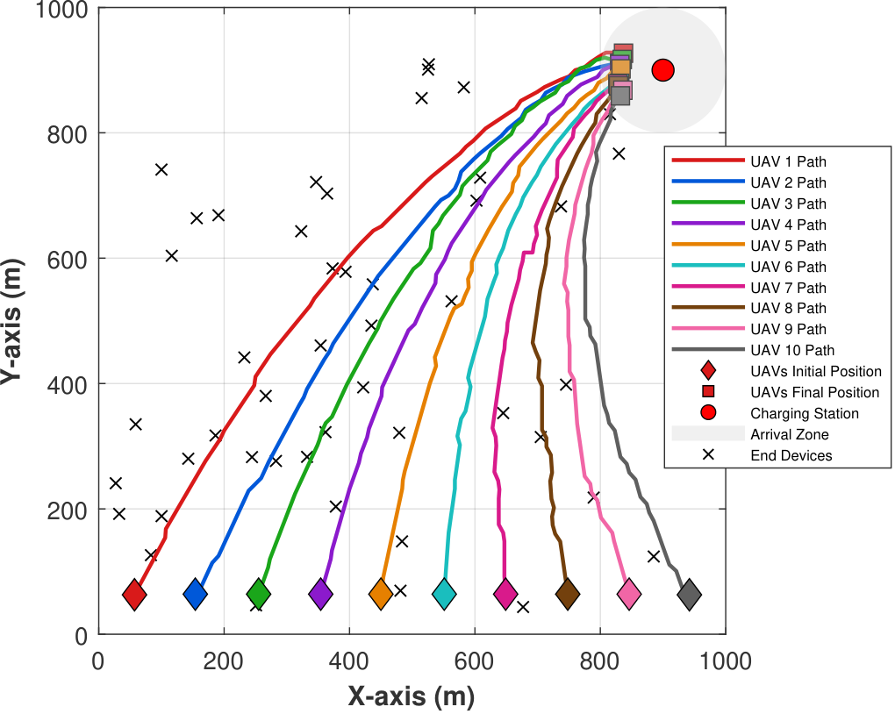 | 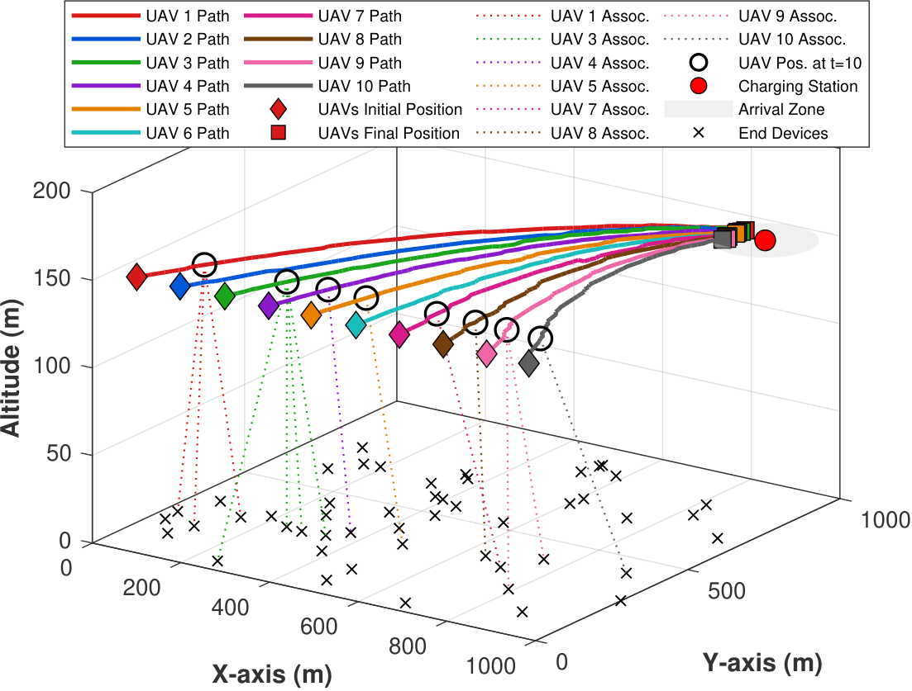 |

With more UAVs available, the policy spreads the communication workload across all of them. Each UAV covers its own part of the area, and the fleet keeps a safe separation throughout the mission. This shows the framework still works well as the number of UAVs grows.

---

## 3. Learned UAV Trajectories for Different Numbers of End Devices

### Scenario A: 200 End Devices

| (a) 2D flight paths | (b) 3D flight paths and device links |
|:-------------------:|:------------------------------------:|
| 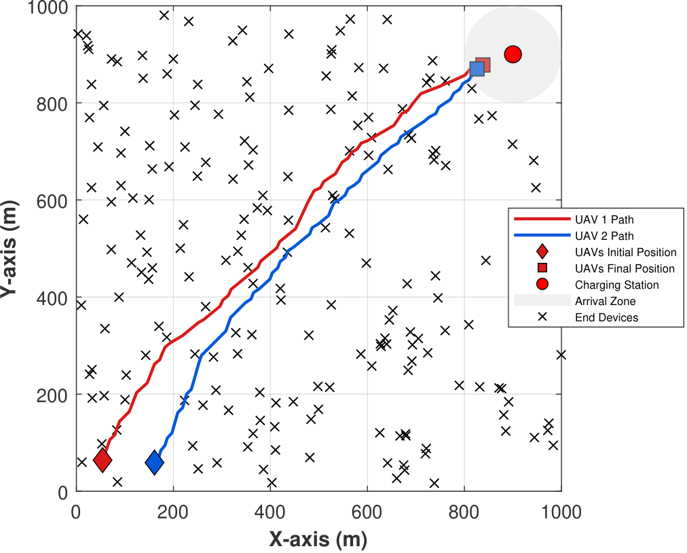 | 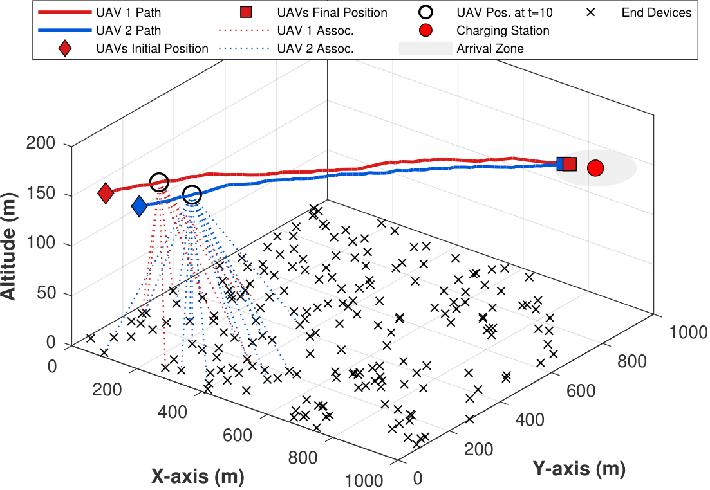 |

Both UAVs steer toward the areas with more active devices before heading to the arrival zone. As they fly, they keep updating which devices they serve. The 3D view again captures these links at **t = 10 s**.

### Scenario B: 400 End Devices

| (a) 2D flight paths | (b) 3D flight paths and device links |
|:-------------------:|:------------------------------------:|
| 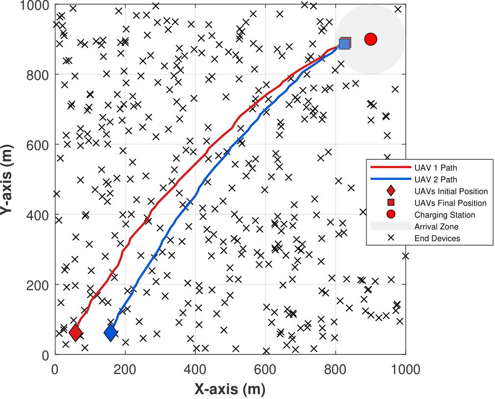 | 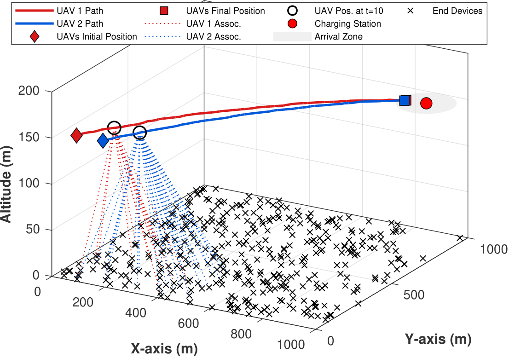 |

When the number of devices doubles to 400, the UAVs keep the same coordinated movement pattern and adapt to the much denser layout. They continue reassigning devices as they move, showing that GLo-MAPPO stays robust as the network gets more crowded.

---

## 4. UAV Collision Comparison

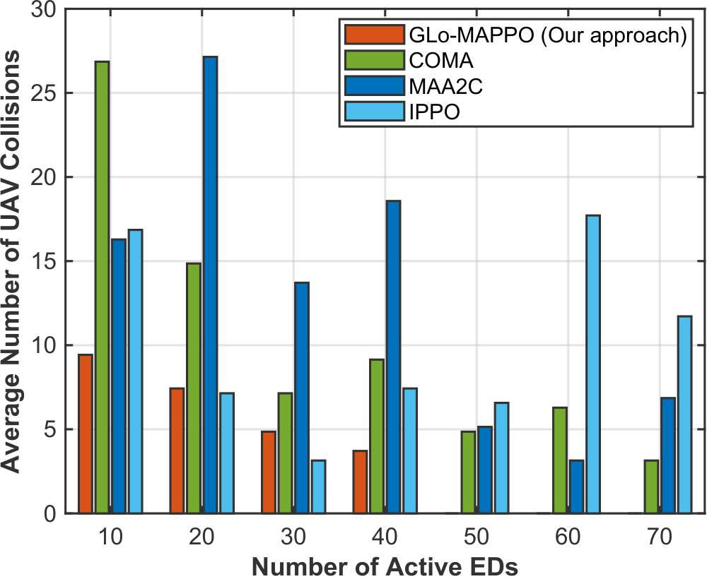

This chart counts how often the UAVs get too close to each other during a mission (a *collision*). We compare our method, GLo-MAPPO, against three SOTA learning methods (COMA, MAA2C, and IPPO) as the number of active devices increases from 10 to 70.

Across every device count, GLo-MAPPO (the orange bars) causes the fewest collisions. Its collision count keeps dropping as the network grows, reaching effectively zero once there are 50 or more active devices. The three other methods stay noticeably higher and show no clear improvement as devices are added. This confirms that GLo-MAPPO learns to keep the UAVs safely separated, and that it does so more reliably than the competing approaches.
